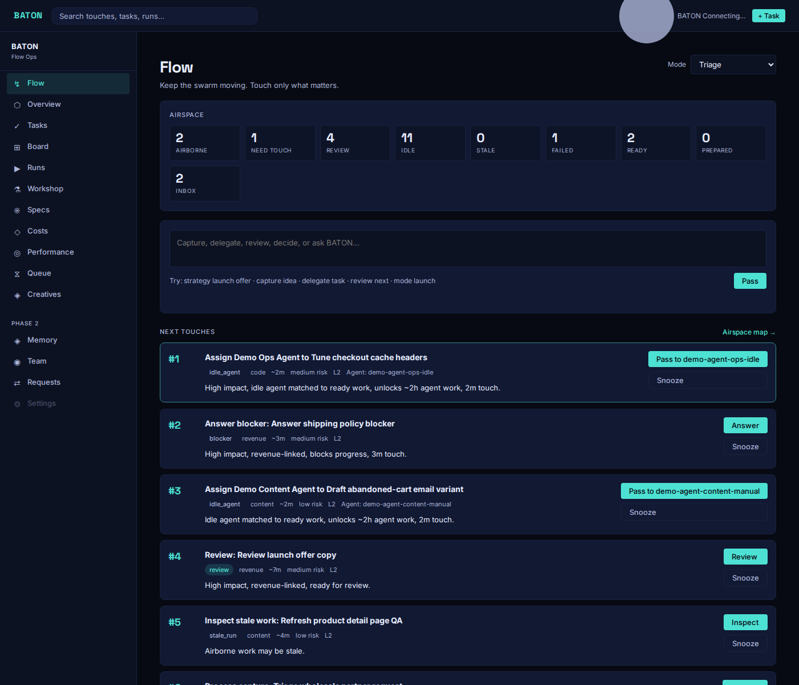

# BATON

**A ranking engine for human attention in multi-agent systems.**

You can spin up ten AI agents in an afternoon. The bottleneck is no longer agent capacity, it is your attention. Agents stall waiting for a decision, an approval, a review, an answer. Dashboards show you agent *status*. None of them answer the operator's actual question:

> **What should I touch next, and why?**

BATON answers it. It treats the true unit of work as a **human touch**: a brief moment where human judgment, approval, or feedback unlocks more agent motion. It watches your tasks, runs, and agents, generates the touches that would unblock the most valuable work, ranks them with an explainable scoring model, and puts the top one in front of you with a one-line `why_now`.

Built and used in production to run a real commerce company with a two-person team and a fleet of agents.



## See it in 60 seconds

```bash
git clone https://github.com/trippyogi/baton.git
cd baton
nvm use # BATON pins Node 20 for better-sqlite3 stability
npm install
npm run demo # seeds realistic demo tasks, agents, runs, and touches
npm start
```

Open `http://127.0.0.1:4200/#/flow`. You'll see a ranked queue of human touches over a live demo workload: reviews waiting, an idle agent that could take ready work, a stale run that needs a nudge, each with a score and a plain-English reason it surfaced now.

No API keys. No external services. SQLite on disk, Redis optional.

## Core concepts

| Concept | What it is |
|---|---|
| **Task** | A broader body of work. |
| **Run** | One execution attempt by an agent, tracked through a strict state machine. |
| **BatonTouch** | A ranked human touch required to keep work moving. The core unit. |
| **Airspace** | Compact live state: running, waiting, review, idle, stale, failed, ready, inbox. |
| **Flow Mode** | Operator mode (`deep_build`, `triage`, `review`, `launch`, ...) that reweights ranking. |
| **Review Packet** | Structured agent output required before human review. Invalid packets are routed to evaluator/refinement work instead of wasting your review time. |
| **Agent** | Worker status/capacity record used for assignment and dispatch. |

## How ranking works

Every candidate touch is scored by an explainable model, not a black box:

- **Base value** = impact × confidence × quality
- **Boosts**: agent-hours unlocked, mode fit, portfolio weight, starvation, manual escalation
- **Costs**: risk, context switching, human minutes required

Each surfaced touch carries a `why_now` string so you can audit the ranking at a glance. The scoring model lives in [`server/lib/flow/ranking.js`](server/lib/flow/ranking.js); the full design rationale is in [docs/architecture.md](docs/architecture.md).

## Honest motion, by design

A few opinionated rules BATON enforces:

- **No fake motion.** Delegating to an agent without a configured transport does not pretend the agent is running. Agents are marked running only after a real ACK.
- **Review is gated.** Agents must submit a valid Review Packet before work reaches your review queue. Malformed output becomes evaluator/refinement work, not your problem.
- **Terminal states are terminal.** The run state machine records every transition and refuses to zombie-walk completed or failed runs.

## Dispatching work to agents

BATON dispatches through a transport-neutral envelope, `baton.dispatch.v1`: prepare a run, send the envelope, wait for ACK, track status callbacks through review and completion.

Two reference integrations are included:

- **Webhook orchestrator** (`npm run fake:spectre` + `npm run smoke:dispatch`): the full dispatch → ACK → review-packet → completion loop against a local fake agent.
- **Local bridge** (`npm run bridge:nectar`): a private, ACK-only local handoff pattern for agents that a human operator drives by hand. See [docs/guides/private-local-use.md](docs/guides/private-local-use.md).

Adding your own agent means implementing one webhook receiver and one status callback.

## Architecture

```text
Task -> Run (state machine) -> dispatch envelope -> Agent
  |                                           |
  +-> BatonTouch (ranked) <- touch generation <- ACK / status / review packet
                     |
                     v
              Flow queue (you)
```

- **Server**: Node 20, Express, better-sqlite3 (WAL), optional Redis for queue/webhook paths, degrades cleanly without it.
- **Client**: dependency-free vanilla JS SPA.
- **Tests**: `npm test` runs JS checks, smoke flows, and an adversarial loop-integrity suite.

Full write-up: [docs/architecture.md](docs/architecture.md).

## Status

BATON is **v0.3, pre-1.0, in daily personal production use**. APIs and schemas may change between minor versions. It is a working system extracted from real operations, not a finished product. Rough edges are documented in the [CHANGELOG](CHANGELOG.md).

## Roadmap

- SSE live updates for the Flow queue (stub exists)
- Pluggable dispatch transports beyond webhook/manual
- Touch automation: "can this touch be automated next time?" suggestions
- Multi-operator support

## Development

```bash
npm test # checks + smoke + adversarial loop
npm run smoke:dispatch # full dispatch loop against a fake agent
npm run audit:private # verifies no private data is tracked
```

Contributions welcome, see [CONTRIBUTING.md](CONTRIBUTING.md). Security policy in [SECURITY.md](SECURITY.md).

## License

MIT
