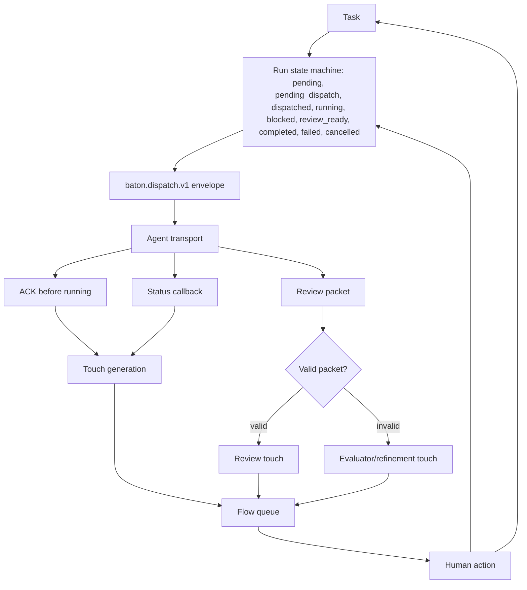

# BATON Architecture

## The thesis

BATON treats the unit of work as a human touch, not an agent run. A touch is the small operator action that unlocks more useful agent motion: review this, answer that, assign an idle agent, inspect stale work, or route malformed output to refinement. BATON generates candidate touches from tasks, runs, agents, and review packets, ranks them with an explainable model, and shows the operator what to touch next with a `why_now` reason. The goal is honest motion: work only moves when the state machine, dispatch ACKs, and review gates say it actually moved.

## Lifecycle diagram

## Ranking model

The scoring model is implemented in `server/lib/flow/ranking.js`. Scores are clamped from 0 to 100, and open touches rank by pinned first, then score, then creation time.

Formula shape:

- **Base value** = `100 * impact * confidence * quality`.
- **Agent motion bonus** = up to 30 points from `agent_hours_unlocked`.
- **Mode fit bonus** = mode-adjusted fit for the touch type.
- **Portfolio bonus** = domain weight from the portfolio map.
- **Starvation bonus** = prevents neglected domains from waiting forever.
- **Urgency bonus** = task urgency from priority and candidate context.
- **Review age bonus** = older review work gets a modest lift.
- **Blocked age bonus** = older blockers get a stronger lift.
- **Idle-agent bonus** = matched idle agents receive a fixed boost.
- **Creative/optionality bonus** = strategy-creative mode values fun and optionality more heavily.
- **Manual escalation and pinned bonuses** = operator override mechanisms.
- **Human touch cost** = subtracts expected human minutes.
- **Context switch cost** = subtracts operator context-switch burden.
- **Risk cost** = subtracts risk.
- **Weak spec cost** = penalizes unclear work.
- **Review debt cost** = discourages delegation when review debt is high.

Every generated touch carries a `why_now` string from `server/lib/flow/explain.js`, so the operator can see the main reasons the touch surfaced.

## Flow modes

Modes are defined in `server/lib/flow/modes.js` and reweight touch types.

- `deep_build`: favors blockers and focused build work while dampening review and capture.
- `triage`: favors blockers, stale runs, reviews, captures, and idle-agent matches.
- `review`: strongly favors review and refinement while reducing delegation.
- `strategy_creative`: favors capture and policy candidates, with extra weight for fun and optionality.
- `launch`: favors blockers, reviews, stale runs, and revenue-linked work.
- `admin`: lowers most creative/build touch weights for administrative passes.
- `cleanup`: favors stale runs, review, blocker cleanup, and policy candidates.
- `recovery`: lowers delegation and stale-run emphasis for recovery-mode restraint.

Modes also define stale-run thresholds. For example, triage and launch consider work stale sooner than admin or recovery.

## Review packet gate

Review packet validation lives in `server/lib/flow/quality.js` and `server/routes/review-packets.js`. A valid packet must include a goal, summary, suggested next action, at least one evidence item, and numeric confidence and quality scores.

Valid packets become review touches. Invalid packets are marked `needs_evaluator` and generate evaluator/refinement touches instead. This protects human review time by preventing malformed or unsupported agent output from entering the normal review queue.

## Run state machine

Run transitions live in `server/lib/runs/state-machine.js`.

States include:

- `pending`
- `pending_dispatch`
- `dispatched`
- `running`
- `blocked`
- `review_ready`
- `completed`
- `failed`
- `cancelled`

Terminal states are `completed`, `failed`, and `cancelled`. Terminal runs reject non-idempotent transitions. Same-status transitions are idempotent by default. Invalid transitions return a conflict and are recorded. Every transition attempt writes to `run_events` with the event, from/to status, actor, payload, and timestamp.

## Dispatch

BATON dispatches through the `baton.dispatch.v1` envelope from `server/lib/dispatch/envelope.js`. The envelope includes run, task, touch, agent, intent, priority, mode, title, objective, instructions, compiled context, attachments, callback URLs, and execution constraints.

Dispatch semantics are intentionally conservative:

1. A run is prepared as `pending_dispatch` and the envelope is stored.
2. If no transport is configured, BATON returns a prepared handoff and does not pretend the agent is running.
3. If webhook transport is configured, BATON sends the envelope and waits for an accepted ACK.
4. Only an accepted ACK moves the run to `running`, the task to `in_progress`, and the agent to `running`.
5. Status callbacks move runs through `running`, `blocked`, `review_ready`, `failed`, or `cancelled`.

Reference integrations:

- Webhook orchestrator: a local fake webhook agent exercises dispatch, ACK, review packet, and completion.
- Local manual bridge: a local ACK-only bridge writes handoff records for a human-operated agent workflow.

## Storage and runtime

BATON runs on Node 20 with Express and a dependency-free vanilla-JS SPA. SQLite is provided by better-sqlite3, uses WAL mode, and defaults to `server/data/vmc.db` unless `BATON_DB_PATH` is set. Redis is optional for queue and webhook-adjacent paths; local development degrades cleanly when Redis is unavailable.
